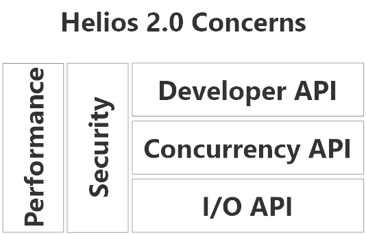

# Helios 2.0 Specifications							

## Why?
[Helios v1.4](http://www.nuget.org/packages/Helios/1.4.0 "Helios v1.4.0") and earlier achieved its goal of being able to provide a solid reactive API on top of the [CLR Socket](https://msdn.microsoft.com/en-us/library/system.net.sockets.socket.aspx) implementation, but it was developed in a rush and without clear goals initially.

Helios found its stride as a core piece of the infrastructure behind Akka.NET - it's function is to serve as high performance networking middleware to power stand-alone apps and other major pieces of .NET infrastructure.

In light of that, many of the design decisions made for Helios 1.x need to be revisited and redone in order to better serve those aims.

The goal of Helios 2.0 is to fully realize the project's goals without any regard for backwards compatibility with previous versions. A full break from the technical debt of the previous iteration, but while retaining the hard lessons learned in its implementation.

## Overarching Goal
Helios's goal can be summarized as the following:

> To provide an asynchronous, high-performance, and reactive programming API in .NET on top of standard networking stacks with minimal overhead for both the CLR and Mono.

The paramount concern with Helios is being extensible enough to fulfill a variety of end-user needs while still offering blazing-fast performance. 

## Concerns
Our design concerns consist of two cross-cutting concerns across three layers.

	

			
	

### Performance
Performance is a cross-cutting concern - it must be evaluated and tested at every level.

